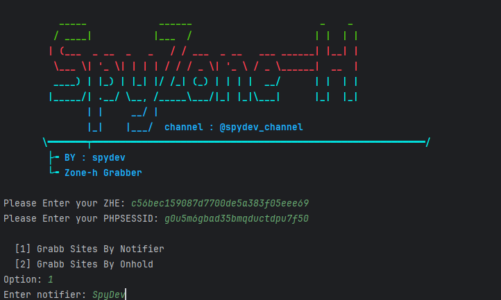

# # SpyZone-h Grabber


## What can it do?
This is zone-h Grabber
the bot extract website from zone-h.org (From notifier name or from onhold)

---

## Requirements
* Python 3
* requests (see [Installation](#Installation))
* colorama (see [Installation](#Installation))

---

## Installation
You can just install the dependencies using pip: `pip install -r requirements.txt`

If you want to manually install the required packages using your preferrec package manager, see [requirements.txt](requirements.txt) for a list of packages

---
**Linux**
```bash
git clone https://github.com/spydevofficial/SpyZone-h
cd SpyZone-h
pip install requests
pip install colorama
python spyzone-h.py
```
**Windows**
```
install python 3 ( add python to path )
python -m pip install requests
python -m pip install colorama
cd SpyZone-h
python spyzone-h.py
```



## Issues & Features
If you find any problems or have a feature request, feel free to contact me.

Telegram : @spydev

Channel  : https://t.me/spydev_Channel
---
